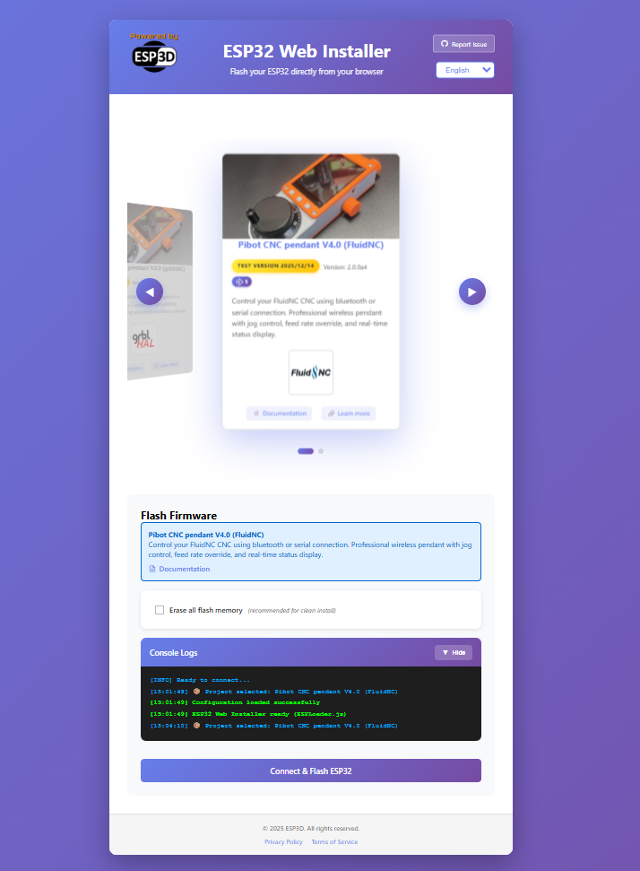

# ESP3D Web Installer

[](https://www.gnu.org/licenses/lgpl-3.0)

A modern, browser-based firmware installer for ESP32 devices using the Web Serial API. Flash your ESP32 directly from your browser without installing any software.



## ✨ Features

- **No installation required** - Works directly in Chrome, Edge, or Opera
- **Multi-project support** - Configure multiple firmware projects with a 3D carousel selector
- **Multi-language support** - English and French included, easily extensible
- **Progress tracking** - Real-time progress bar and detailed console logs
- **Error categorization** - Detailed error logging for debugging and improvement
- **Flash statistics** - Track successful flashes per project
- **Fully customizable** - Branding, colors, footer links via configuration files
- **Privacy-focused** - All firmware flashing happens locally in your browser
- **Offline capable** - No external CDN dependencies (ESPTool.js hosted locally)

## 🚀 Quick Start

### Prerequisites

- A web server with PHP support (Apache, Nginx, or local development server)
- A compatible browser: Chrome 89+, Edge 89+, or Opera 75+
- ESP32 device with USB connection

### Installation

1. **Clone the repository:**
   ```bash
   git clone https://github.com/luc-github/esp3d-webinstaller.git
   cd esp3d-webinstaller
   ```

2. **Download ESPTool.js bundle:**
   ```bash
   curl -L "https://unpkg.com/esptool-js@0.4.5/bundle.js" -o js/esptool-bundle.js
   ```
   Or download manually from [unpkg.com/esptool-js@0.4.5/bundle.js](https://unpkg.com/esptool-js@0.4.5/bundle.js)

3. **Add your firmware files:**
   ```
   firmware/
   └── your-project/
       ├── bootloader.bin
       ├── partitions.bin
       └── firmware.bin
   ```

4. **Configure your project** (see [Configuration](#-configuration) section)

5. **Deploy to your web server** or test locally:
   ```bash
   # Using PHP built-in server
   php -S localhost:8000
   ```

6. **Open in browser:** `http://localhost:8000`

## 📁 Project Structure

```
esp3d-webinstaller/
├── index.html              # Main application page
├── privacy.html            # Privacy policy page
├── terms.html              # Terms of service page
├── style.css               # Application styles
│
├── js/
│   ├── script.js           # Main application logic
│   └── esptool-bundle.js   # ESPTool.js library (download separately)
│
├── config.json             # Project/firmware configuration
├── page-config.json        # Page branding and settings
│
├── lang/
│   ├── en.json             # English translations
│   └── fr.json             # French translations
│
├── log-flash.php           # Flash event logging endpoint
├── get-flash-counts.php    # Retrieve flash statistics
├── get-flash-errors.php    # Retrieve detailed error logs
├── flash-counts.json       # Flash statistics data
├── flash-errors.json       # Detailed error logs
│
├── images/
│   ├── powered-logo.png    # Header logo
│   ├── favicon.ico         # Browser favicon
│   └── espressif.png       # Credits logo
│
└── firmware/
    └── your-project/
        ├── bootloader.bin
        ├── partitions.bin
        └── firmware.bin
```

## ⚙️ Configuration

### `config.json` - Firmware Projects

This file defines the firmware projects available in the installer.

```json
{
  "projects": [
    {
      "id": "my-project",
      "name": "My ESP32 Project",
      "enabled": true,
      "description": {
        "en": "English description of your project",
        "fr": "Description française de votre projet"
      },
      "version": "1.0.0",
      "firmware": [
        { "path": "my-project/bootloader.bin", "offset": "0x1000" },
        { "path": "my-project/partitions.bin", "offset": "0x8000" },
        { "path": "my-project/firmware.bin", "offset": "0x10000" }
      ],
      "image": "images/my-project.png",
      "icon": "images/my-project-icon.svg",
      "url": "https://your-project-website.com",
      "documentation": "https://your-project-docs.com",
      "badge": {
        "en": "Stable",
        "fr": "Stable"
      }
    }
  ]
}
```

| Field | Type | Description |
|-------|------|-------------|
| `id` | string | Unique identifier for the project |
| `name` | string | Display name shown in the carousel |
| `enabled` | boolean | Set to `false` to show as "coming soon" |
| `description` | object | Localized descriptions (en, fr, etc.) |
| `version` | string | Firmware version displayed on the card |
| `firmware` | array/string | Firmware files with flash offsets |
| `image` | string | Project card image (optional) |
| `icon` | string | Small icon for the card header (optional) |
| `url` | string | Link to project website (optional) |
| `documentation` | string | Link to documentation (optional) |
| `badge` | object | Localized badge text (e.g., "Beta", "Stable") |

### `page-config.json` - Page Settings

This file configures branding, links, and visual settings.

```json
{
  "branding": {
    "logo": "images/powered-logo.png",
    "favicon": "images/favicon.ico"
  },
  },
  "languages": [
    {
      "code": "en",
      "name": "English",
      "default": true
    },
    {
      "code": "fr",
      "name": "Français"
    }
  ],
  "links": {
  "links": {
    "github": {
      "enabled": true,
      "url": "https://github.com/your-repo/issues/new"
    }
  },
  "footer": {
    "enabled": true,
    "links": [
      { "key": "privacyPolicy", "url": "privacy.html" },
      { "key": "termsOfService", "url": "terms.html" }
    ]
  },
  "browser_compatibility": {
    "show_warning": true,
    "supported_browsers": ["Chrome", "Edge", "Opera"]
  },
  "theme": {
    "primary_color": "#667eea",
    "secondary_color": "#764ba2",
    "success_color": "#00ff00",
    "error_color": "#ff5555",
    "warning_color": "#ffaa00"
  },
  },
  },
  },
  "audio_feedback": {
    "enabled": true,
    "verbosity": "normal",
    "volume": 0.7,
    "events": {
      "start": "sounds/[lang]/start.mp3",
      "boot_prompt": "sounds/[lang]/press-boot.mp3",
      "connected": "sounds/[lang]/connected.mp3",
      "erasing": "sounds/[lang]/erasing.mp3",
      "flashing_start": "sounds/[lang]/flashing-start.mp3",
      "success": "sounds/[lang]/success.mp3",
      "error": "sounds/error.mp3"
    }
  }
}
```

| `analytics`|`false` for static hosting (GitHub Pages),`true` for PHP server with logging |
| `branding` | Logo and favicon paths |
| `languages` | Available languages configuration |
| `links.github` | "Report Issue" button configuration |
| `footer` | Footer visibility and legal page links |
| `browser_compatibility` | Warning for unsupported browsers |
| `theme` | Color scheme (CSS variables) |
| `audio_feedback` | Audio notification system (optional) |

#### Languages Configuration

The `languages` section configures which languages are available. The language selector automatically hides when only one language is configured.

| Option | Type | Required | Description |
|--------|------|----------|-------------|
| `code` | string | Yes | Language code (must match filename in `lang/` folder) |
| `name` | string | Yes | Display name in language selector |
| `default` | boolean | No | Set to `true` for default language (only one) |

**Examples:**

```json
// Multiple languages (selector visible)
"languages": [
  { "code": "en", "name": "English", "default": true },
  { "code": "fr", "name": "Français" },
  { "code": "es", "name": "Español" }
]

// Single language (selector hidden)
"languages": [
  { "code": "en", "name": "English", "default": true }
]

// If omitted, defaults to English only
```

**Adding a new language:**

1. Create translation file: `lang/es.json` (copy from `lang/en.json`)
2. Translate all values in the file
3. Add to `page-config.json`:
   ```json
   { "code": "es", "name": "Español" }
   ```

No code changes needed - the language selector updates automatically!

#### Audio Notification System

The audio notification system provides real-time audio feedback throughout the entire flashing process. All sounds are **completely optional** and **fully configurable** with three verbosity levels.

**Verbosity Levels:**

- **Minimal** 🔇 - Essential sounds only (start, success, error)
- **Normal** 🔊 - Key milestones (recommended for most users)
- **Verbose** 📢 - Every step with detailed feedback

##### Configuration

| Option | Type | Default | Description |
|--------|------|---------|-------------|
| `enabled` | boolean | `false` | Enable/disable audio feedback |
| `verbosity` | string | `"normal"` | Audio level: `"minimal"`, `"normal"`, or `"verbose"` |
| `volume` | number | `0.7` | Global volume (0.0 to 1.0) |
| `events` | object | `{}` | Map of events to sound files |

##### Audio Events by Verbosity Level

**Minimal (3 events):**
- `start` - Flash process begins
- `success` - Flash completed successfully
- `error` - Flash failed (categorized by error type)

**Normal (7 events):**
All minimal events plus:
- `boot_prompt` - "Press and hold BOOT button"
- `connected` - Connected to ESP32
- `erasing` - Erasing flash memory
- `flashing_start` - Writing firmware begins

**Verbose (14 events):**
All normal events plus:
- `dialog_open` - Port selection dialog opens
- `port_selected` - User selected a port
- `connecting` - Attempting connection
- `erase_complete` - Erase finished
- `flashing_progress` - Progress milestones (25%, 50%, 75%)
- `writing_complete` - All data written
- `rebooting` - Device rebooting

##### Error Categories

Error sounds are automatically categorized:

| Category | Triggered when | Example sound |
|----------|----------------|---------------|
| `user_cancel` | User cancelled port selection | Soft/gentle tone |
| `connection_timeout` | Timeout connecting to ESP32 | Clock/timeout beep |
| `port_busy` | Port in use by another app | Busy signal |
| `hardware_error` | ESP32 chip/flash error | Critical error beep |
| `download_failed` | Firmware download failed | Download error |
| `wrong_browser` | Unsupported browser | Browser error |
| `flash_error` | Generic flash error | Standard error beep |

##### Configuration

| Option | Type | Default | Description |
|--------|------|---------|-------------|
| `enabled` | boolean | `false` | Enable/disable audio feedback |
| `verbosity` | string | `"normal"` | Audio level: `"minimal"`, `"normal"`, or `"verbose"` |
| `volume` | number | `0.7` | Global volume (0.0 to 1.0) |
| `events` | object | `{}` | Map of events to sound files |

##### Multilingual Audio Support

Audio files can be organized by language using the `[lang]` placeholder in paths. The system automatically replaces `[lang]` with the current language code.

**Example configuration:**
```json
"audio_feedback": {
  "enabled": true,
  "events": {
    "start": "sounds/[lang]/start.mp3",
    "boot_prompt": "sounds/[lang]/press-boot.mp3",
    "connected": "sounds/[lang]/connected.mp3",
    "success": "sounds/[lang]/success.mp3",
    "error": "sounds/error.mp3"
  }
}
```

**File structure:**
```
sounds/
├── en/
│   ├── start.mp3              "Ok let's go!"
│   ├── press-boot.mp3         "Press and hold BOOT button"
│   ├── connected.mp3          "Connected"
│   └── success.mp3            "Success!"
├── fr/
│   ├── start.mp3              "C'est parti !"
│   ├── press-boot.mp3         "Appuyez sur BOOT"
│   ├── connected.mp3          "Connecté"
│   └── success.mp3            "Succès !"
└── error.mp3                  ← Universal sound (no translation)
```

**How it works:**
- User selects English → `sounds/[lang]/start.mp3` becomes `sounds/en/start.mp3`
- User selects French → `sounds/[lang]/start.mp3` becomes `sounds/fr/start.mp3`

**Mix and match:**
You can combine multilingual and universal sounds. Use `[lang]` for verbal messages that need translation, and direct paths for universal sound effects (beeps, tones).

##### Audio Events by Verbosity Level
##### Audio Events by Verbosity Level

**Minimal (3 events):**
- `start` - Flash process begins
- `success` - Flash completed successfully
- `error` - Flash failed (categorized by error type)

**Normal (7 events):**
All minimal events plus:
- `boot_prompt` - "Press and hold BOOT button"
- `connected` - Connected to ESP32
- `erasing` - Erasing flash memory
- `flashing_start` - Writing firmware begins

**Verbose (14 events):**
All normal events plus:
- `dialog_open` - Port selection dialog opens
- `port_selected` - User selected a port
- `connecting` - Attempting connection
- `erase_complete` - Erase finished
- `flashing_progress` - Progress milestones (25%, 50%, 75%)
- `writing_complete` - All data written
- `rebooting` - Device rebooting

##### Error Categories

Error sounds are automatically categorized:

| Category | Triggered when | Example sound |
|----------|----------------|---------------|
| `user_cancel` | User cancelled port selection | Soft/gentle tone |
| `connection_timeout` | Timeout connecting to ESP32 | Clock/timeout beep |
| `port_busy` | Port in use by another app | Busy signal |
| `hardware_error` | ESP32 chip/flash error | Critical error beep |
| `download_failed` | Firmware download failed | Download error |
| `wrong_browser` | Unsupported browser | Browser error |
| `flash_error` | Generic flash error | Standard error beep |

##### Configuration Examples

**Minimal (essentials only):**
```json
{
  "audio_feedback": {
    "enabled": true,
    "verbosity": "minimal",
    "volume": 0.7,
    "events": {
      "start": "sounds/start.mp3",
      "success": "sounds/success.mp3",
      "error": "sounds/error.mp3"
    }
  }
}
```

**Normal (recommended):**
```json
{
  "audio_feedback": {
    "enabled": true,
    "verbosity": "normal",
    "volume": 0.7,
    "events": {
      "start": "sounds/start.mp3",
      "boot_prompt": "sounds/press-boot.mp3",
      "connected": "sounds/connected.mp3",
      "erasing": "sounds/erasing.mp3",
      "flashing_start": "sounds/flashing-start.mp3",
      "success": "sounds/success.mp3",
      "error": "sounds/error.mp3",
      "error_user_cancel": "sounds/cancel.mp3",
      "error_connection_timeout": "sounds/timeout.mp3",
      "error_port_busy": "sounds/busy.mp3",
      "error_hardware_error": "sounds/hardware-error.mp3"
    }
  }
}
```

**Verbose (full experience):**
```json
{
  "audio_feedback": {
    "enabled": true,
    "verbosity": "verbose",
    "volume": 0.7,
    "events": {
      "start": "sounds/start.mp3",
      "dialog_open": "sounds/select-port.mp3",
      "port_selected": "sounds/port-selected.mp3",
      "boot_prompt": "sounds/press-boot.mp3",
      "connecting": "sounds/connecting.mp3",
      "connected": "sounds/connected.mp3",
      "erasing": "sounds/erasing.mp3",
      "erase_complete": "sounds/erase-complete.mp3",
      "flashing_start": "sounds/flashing-start.mp3",
      "flashing_progress": "sounds/progress.mp3",
      "writing_complete": "sounds/writing-complete.mp3",
      "rebooting": "sounds/rebooting.mp3",
      "success": "sounds/success.mp3",
      "error": "sounds/error.mp3",
      "error_user_cancel": "sounds/cancel.mp3",
      "error_connection_timeout": "sounds/timeout.mp3",
      "error_port_busy": "sounds/busy.mp3",
      "error_hardware_error": "sounds/hardware-error.mp3",
      "error_download_failed": "sounds/download-error.mp3",
      "error_wrong_browser": "sounds/browser-error.mp3",
      "error_flash_error": "sounds/flash-error.mp3"
    }
  }
}
```

**File structure:**
```
esp3d-webinstaller/
├── sounds/
│   ├── start.mp3              # Flash begins
│   ├── select-port.mp3        # Dialog opens (verbose)
│   ├── port-selected.mp3      # Port selected (verbose)
│   ├── press-boot.mp3         # BOOT button prompt
│   ├── connecting.mp3         # Connecting (verbose)
│   ├── connected.mp3          # Connected successfully
│   ├── erasing.mp3            # Erasing flash
│   ├── erase-complete.mp3     # Erase done (verbose)
│   ├── flashing-start.mp3     # Writing begins
│   ├── progress.mp3           # Progress milestone (verbose)
│   ├── writing-complete.mp3   # Writing done (verbose)
│   ├── rebooting.mp3          # Rebooting device (verbose)
│   ├── success.mp3            # Success!
│   ├── error.mp3              # Generic error
│   ├── cancel.mp3             # User cancelled
│   ├── timeout.mp3            # Connection timeout
│   ├── busy.mp3               # Port busy
│   ├── hardware-error.mp3     # Hardware error
│   ├── download-error.mp3     # Download failed
│   ├── browser-error.mp3      # Wrong browser
│   └── flash-error.mp3        # Flash error
└── ...
```

**Getting sound files:**
- Text-to-speech: [ttsmaker.com](https://ttsmaker.com/)
- Sound effects: [freesound.org](https://freesound.org/), [mixkit.co](https://mixkit.co/)
- Keep files under 500KB each

> [!NOTE]
>
> All current sounds were created using [Elevenlabs](https://elevenlabs.io/) text-to-speech technology and the "Akito" voice preset.
>
> Certain sounds can be too long to play instantly. Because they are queued, playback may be delayed and fall out of sync with real-time actions. In these cases, omit sounds for steps that are too close in timing to preserve a natural audio flow.

## 📊 Logging and Analytics

The installer includes a logging system to track flash statistics and errors, helping you understand usage patterns and debug issues.

### `flash-counts.json` - Statistics

Automatically updated with each flash attempt:

```json
{
  "My ESP32 Project": {
    "total": 150,
    "success": 142,
    "failed": 8
  }
}
```

### `flash-errors.json` - Detailed Error Logs

Captures detailed information about failures:

```json
{
  "lastUpdated": "2024-12-14T10:30:00Z",
  "totalErrors": 8,
  "categoryCounts": {
    "connection_timeout": 3,
    "user_cancel": 2,
    "port_busy": 2,
    "wrong_browser": 1
  },
  "entries": [
    {
      "id": "err_abc123",
      "timestamp": "2024-12-14T10:30:00Z",
      "project": "My ESP32 Project",
      "error": "Timeout waiting for sync",
      "category": "connection_timeout",
      "context": {
        "browser": { "name": "Chrome", "version": "120", "os": "Windows" },
        "stage": "connecting"
      }
    }
  ]
}
```

### Error Categories

| Category | Description | Typical Cause |
|----------|-------------|---------------|
| `user_cancel` | User cancelled the operation | User didn't select a port |
| `port_busy` | Serial port unavailable | Another app using the port |
| `connection_timeout` | Timeout connecting to ESP32 | BOOT button not pressed |
| `download_failed` | Failed to download firmware | Network or server issue |
| `hardware_error` | Chip or flash memory error | Hardware problem |
| `wrong_browser` | Unsupported browser | Firefox, Safari, etc. |
| `flash_error` | Generic flash error | Various causes |

### API Endpoints

**Get flash counts:**
```
GET /get-flash-counts.php
```

**Get error summary:**
```
GET /get-flash-errors.php?summary=true
```

**Get filtered errors:**
```
GET /get-flash-errors.php?category=connection_timeout&limit=50
GET /get-flash-errors.php?project=My%20Project&limit=100
```

## 🔒 File Permissions

Ensure the PHP files can write to the JSON data files:

```bash
chmod 644 flash-counts.json flash-errors.json
chmod 755 log-flash.php get-flash-counts.php get-flash-errors.php
```

On some servers, you may need to set ownership:
```bash
chown www-data:www-data flash-counts.json flash-errors.json
```

## 🌐 Browser Support

| Browser | Minimum Version | Status |
|---------|----------------|--------|
| Chrome | 89+ | ✅ Fully supported |
| Edge | 89+ | ✅ Fully supported |
| Opera | 75+ | ✅ Fully supported |
| Firefox | - | ❌ No Web Serial API |
| Safari | - | ❌ No Web Serial API |

## 🚀 Deployment

### GitHub Pages (Static)

1. Set `"analytics": false` in `page-config.json`

2. Remove PHP files (not needed):
   ```bash
   rm log-flash.php get-flash-counts.php get-flash-errors.php
   rm flash-counts.json flash-errors.json
   ```

3. Push to GitHub and enable GitHub Pages in repository settings.

4. Your installer will be available at `https://username.github.io/repository/`

### PHP Server (With Analytics)

1. Set `"analytics": true` in `page-config.json`

2. Create the secret files directory (see Security section below for placement options)

3. Generate a secret key:
   ```bash
   openssl rand -base64 32 > /path/to/secret_files/mykey.txt
   ```

4. Update the path in `log-flash.php` to match your setup:
   ```php
   'secret_key_file' => __DIR__ . '/../secret_files/mykey.txt',
   ```

5. Set permissions:
   ```bash
   chmod 700 /path/to/secret_files/
   chmod 600 /path/to/secret_files/mykey.txt
   chmod 644 flash-counts.json flash-errors.json
   chmod 755 log-flash.php get-flash-counts.php get-flash-errors.php
   ```

6. Configure allowed origins in `log-flash.php`:
   ```php
   'allowed_origins' => [
       'localhost',
       'yourdomain.com',
       'www.yourdomain.com',
   ],
   ```

7. Deploy to your PHP-enabled web server.

## 🔒 Security (PHP Server)

When running with `analytics: true`, the following security measures are implemented:

| Security Layer | Description |
|----------------|-------------|
| **Secret Key File** | Verifies script runs on legitimate server (file outside web access) |
| **Rate Limiting** | Max 10 requests/minute, 50 requests/hour per IP |
| **Input Validation** | Sanitizes all input, limits string lengths |
| **File Size Limits** | Counts: 1MB max, Errors: 5MB max |
| **Origin Check** | Validates Referer/Origin header |
| **Honeypot** | Detects bot submissions |
| **Payload Limit** | Max 10KB per request |

### Secret Files Placement

#### Option A: Outside web root (Recommended)

Place `secret_files/` at the same level as your web root, not inside it:

```
/var/www/
├── webinstaller/            <- Web root (HTTP accessible)
│   ├── index.html
│   ├── log-flash.php
│   ├── flash-counts.json
│   └── ...
└── secret_files/            <- Outside web root (NOT HTTP accessible)
    ├── mykey.txt
    └── rate_limits.json     <- Auto-generated
```

In `log-flash.php`, use:
```php
'secret_key_file' => __DIR__ . '/../secret_files/mykey.txt',
'rate_limit_file' => __DIR__ . '/../secret_files/rate_limits.json',
```

**✅ No additional web server configuration needed** - the directory is simply not served.

#### Option B: Inside web root with access denied

If you cannot place files outside the web root, put `secret_files/` inside and block access:

```
/var/www/webinstaller/       <- Web root
├── index.html
├── log-flash.php
└── secret_files/            <- Inside web root, access blocked
    ├── .htaccess            <- Required for Apache
    ├── mykey.txt
    └── rate_limits.json
```

In `log-flash.php`, use:
```php
'secret_key_file' => __DIR__ . '/secret_files/mykey.txt',
'rate_limit_file' => __DIR__ . '/secret_files/rate_limits.json',
```

**Apache** - Create `secret_files/.htaccess`:
```apache
Require all denied
```

**Nginx** - Add to your server block:
```nginx
location /secret_files/ {
    deny all;
    return 403;
}
```

### Verify Security

Test that `secret_files/` is NOT accessible:
```bash
curl -I https://yourdomain.com/secret_files/mykey.txt
# Should return 403 Forbidden or 404 Not Found
```

## 🛠️ Development

### Local Development Server

```bash
# PHP built-in server
php -S localhost:8000

# Or with Python
python -m http.server 8000
```

Note: PHP server is required for logging functionality.

### Updating ESPTool.js

To update to a newer version:
```bash
curl -L "https://unpkg.com/esptool-js@VERSION/bundle.js" -o js/esptool-bundle.js
```

Check [esptool-js releases](https://github.com/espressif/esptool-js/releases) for available versions.

## 🤝 Contributing

Contributions are welcome! Please feel free to submit issues and pull requests.

1. Fork the repository
2. Create your feature branch (`git checkout -b feature/amazing-feature`)
3. Commit your changes (`git commit -m 'Add amazing feature'`)
4. Push to the branch (`git push origin feature/amazing-feature`)
5. Open a Pull Request

For questions and discussions, please use [GitHub Discussions](https://github.com/luc-github/esp3d-webinstaller/discussions).

## 📄 License

This project is licensed under the **GNU Lesser General Public License v3.0** - see the [LICENSE](LICENSE) file for details.

## 🙏 Credits

### ESPTool.js

This project uses the excellent [esptool-js](https://github.com/espressif/esptool-js) library for ESP32 communication.

<a href="https://github.com/espressif/esptool-js">
  
</a>

**esptool-js** is developed by [Espressif Systems](https://www.espressif.com/) and is licensed under the Apache License 2.0.

### Web Serial API

Communications with ESP32 are done using [Web Serial API](https://developer.mozilla.org/en-US/docs/Web/API/Web_Serial_API).

<a href="https://developer.mozilla.org/en-US/docs/Web/API/Web_Serial_API">
  

The browser serial communication API from Mozilla.

<br/>
<br/>
Made with ❤️ for the ESP32 community
